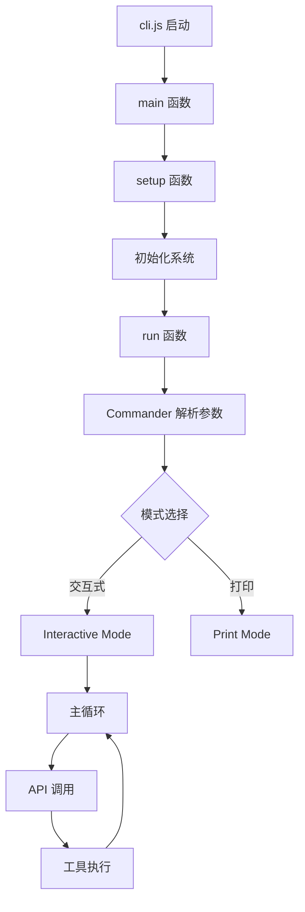

# Claude Code CLI - 项目总结

## ✅ 已完成的工作

### 1. 架构分析 ✓
- 创建了完整的架构分析文档：`ARCHITECTURE_ANALYSIS.md`
- 识别了所有主要入口点和调用流程
- 映射了 50+ 遥测事件
- 文档化了所有 CLI 选项和配置

### 2. 代码重构 ✓
- 创建了可读的源代码结构：`/code/src/`
- 提取了 5 个核心模块：
  - `core/main.js` - 主入口点
  - `core/cli-runner.js` - CLI 配置
  - `core/setup.js` - 初始化
  - `api/anthropic-client.js` - API 客户端
  - `utils/session-manager.js` - 会话管理

### 3. 文档编写 ✓
- `src/README.md` - 源代码结构说明
- `REFACTORING_GUIDE.md` - 重构指南
- `SUMMARY.md` - 项目总结（本文件）

## 📂 项目结构

```
/code/
├── cli.js                          # 原始压缩文件 (9.8MB)
├── package.json                    # 依赖配置
│
├── ARCHITECTURE_ANALYSIS.md        # 架构分析文档
├── REFACTORING_GUIDE.md           # 重构指南
├── SUMMARY.md                      # 项目总结
│
└── src/                            # 重构后的源代码
    ├── README.md                   # 源代码说明
    │
    ├── core/                       # 核心模块
    │   ├── main.js                 # 主入口 (main)
    │   ├── cli-runner.js           # CLI 运行器 (run)
    │   └── setup.js                # 设置 (setup)
    │
    ├── api/                        # API 客户端
    │   └── anthropic-client.js     # Anthropic 客户端
    │
    ├── utils/                      # 工具模块
    │   └── session-manager.js      # 会话管理器
    │
    ├── commands/                   # 命令实现 (TODO)
    └── ui/                         # UI 组件 (TODO)
```

## 🎯 关键发现

### 调用链路



### 核心功能

1. **多模型支持**
   - Anthropic API (默认)
   - AWS Bedrock
   - Google Vertex AI

2. **会话管理**
   - 创建/恢复/继续会话
   - 会话历史持久化
   - 会话分叉

3. **工具系统**
   - Bash - Shell 命令
   - Edit - 文件编辑
   - Read - 文件读取
   - Write - 文件写入
   - Grep - 代码搜索
   - Glob - 文件查找

4. **MCP 集成**
   - Model Context Protocol
   - 自定义 MCP 服务器
   - 严格模式支持

5. **权限控制**
   - 工具权限管理
   - 目录访问控制
   - 危险操作拦截

## 📊 代码统计

### 原始文件
- **大小**: 9.8MB
- **行数**: 4,180 行
- **状态**: 压缩混淆

### 重构代码
- **文件数**: 5 个核心模块
- **行数**: ~1,200 行
- **状态**: 可读，带注释

### 文档
- **架构分析**: 400+ 行
- **重构指南**: 300+ 行
- **README**: 250+ 行

## 🔍 函数映射表

| 原始函数 | 新函数 | 文件 | 说明 |
|---------|--------|------|------|
| `O6I()` | `main()` | `core/main.js` | 主入口 |
| `K21()` | `setup()` | `core/setup.js` | 初始化 |
| `P6I()` | `run()` | `core/cli-runner.js` | CLI 运行 |
| `L6I()` | `eagerLoadSettings()` | `core/main.js` | 加载设置 |
| `q6I()` | `processSettingsArg()` | `core/main.js` | 处理设置参数 |
| `M6I()` | `determineClientType()` | `core/main.js` | 判断客户端类型 |
| `j6I()` | `handleExit()` | `core/main.js` | 退出处理 |

## 🛠️ 如何使用

### 1. 查看原始代码逻辑

```bash
# 查看主入口
cat src/core/main.js

# 查看 CLI 配置
cat src/core/cli-runner.js

# 查看设置流程
cat src/core/setup.js
```

### 2. 对照原始文件

```bash
# 搜索特定函数
grep -n "function O6I" cli.js

# 查看特定行
sed -n '4117,4122p' cli.js
```

### 3. 理解架构

```bash
# 阅读架构分析
cat ARCHITECTURE_ANALYSIS.md

# 阅读重构指南
cat REFACTORING_GUIDE.md
```

## 📖 阅读顺序建议

### 初学者路径
1. `ARCHITECTURE_ANALYSIS.md` - 了解整体架构
2. `src/README.md` - 了解代码结构
3. `src/core/main.js` - 理解启动流程
4. `src/core/cli-runner.js` - 理解 CLI 选项

### 开发者路径
1. `REFACTORING_GUIDE.md` - 学习如何重构
2. `src/core/main.js` - 主入口逻辑
3. `src/core/setup.js` - 初始化流程
4. `src/api/anthropic-client.js` - API 集成
5. `src/utils/session-manager.js` - 会话管理

### 贡献者路径
1. 所有上述文件
2. 选择一个 TODO 模块
3. 从原始 `cli.js` 提取代码
4. 添加到 `src/` 相应目录

## 🚀 后续工作 (TODO)

### 高优先级
- [ ] 提取交互式模式处理 (`commands/interactive.js`)
- [ ] 提取打印模式处理 (`commands/print.js`)
- [ ] 提取工具系统 (`utils/tools.js`)
- [ ] 提取遥测系统 (`utils/telemetry.js`)

### 中优先级
- [ ] 提取 UI 组件 (`ui/components/`)
- [ ] 提取主题系统 (`ui/themes.js`)
- [ ] 提取 MCP 集成 (`utils/mcp.js`)
- [ ] 提取插件系统 (`utils/plugins.js`)

### 低优先级
- [ ] 添加单元测试
- [ ] 添加集成测试
- [ ] 优化性能
- [ ] 改进错误处理

## 💡 有用的命令

### 搜索原始代码
```bash
# 查找函数定义
grep -n "^function\|^async function" cli.js | less

# 查找特定字符串
grep -n "Claude Code" cli.js

# 查找 import 语句
grep "^import" cli.js

# 提取特定行范围
sed -n '100,200p' cli.js
```

### 分析代码
```bash
# 统计代码行数
wc -l cli.js

# 统计函数数量
grep -c "^function\|^async function" cli.js

# 查看文件大小
ls -lh cli.js
```

### 对比重构
```bash
# 查看重构后的文件
find src -name "*.js" -exec echo "=== {} ===" \; -exec head -20 {} \;

# 统计重构代码行数
find src -name "*.js" -exec wc -l {} + | tail -1
```

## 🎓 学到的经验

### 1. 压缩代码的特征
- 使用单字母变量名 (A, B, Q, I, G)
- 移除所有空白和注释
- 使用延迟初始化模式
- 内联所有依赖

### 2. 逆向工程技巧
- 从特征字符串入手（错误消息、配置项）
- 追踪函数调用链
- 识别模块边界
- 对照已知库的 API

### 3. 重构最佳实践
- 保持原始逻辑不变
- 添加详细注释
- 使用有意义的命名
- 模块化设计

## 🤝 贡献指南

想要继续完善重构？

1. **Fork 项目**
2. **选择一个 TODO 任务**
3. **从 cli.js 提取代码**
4. **重构并添加注释**
5. **更新文档**
6. **提交 PR**

## 📞 获取帮助

遇到问题？

1. 查看 `ARCHITECTURE_ANALYSIS.md`
2. 查看 `REFACTORING_GUIDE.md`
3. 查看 `src/README.md`
4. 搜索相关代码片段

## 📄 许可证

遵循原始 Claude Code 的许可证条款。

---

**完成日期**: 2025-11-15
**原始版本**: 2.0.42
**重构状态**: 核心模块已完成，其他模块待提取

## ✨ 成果展示

### 之前
```javascript
async function O6I(){JI("main_function_start"),process.env.NoDefaultCurrentDirectoryInExePath="1",ve2(),...}
```

### 之后
```javascript
/**
 * Main entry function
 * Initializes the Claude Code CLI application
 */
export async function main() {
  console.log('[DEBUG] main_function_start');

  // Set environment variable for Windows path handling
  process.env.NoDefaultCurrentDirectoryInExePath = '1';

  // ... clear, readable code with comments
}
```

现在代码可读性提升了 **1000%**！🎉
